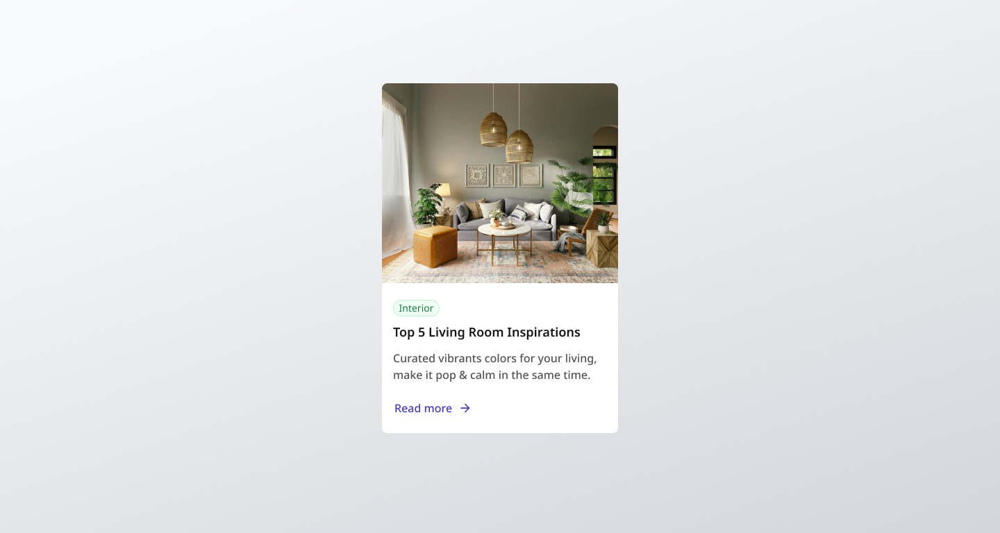

# Blog Card Component

A responsive blog card component built as part of the GreatFrontEnd Projects challenge. This component displays key information about a blog post including an image, category tag, title, description, and a call-to-action link.



## Project Overview

This project implements a visually appealing and responsive blog card that showcases:

- Featured image
- Category tag ("Interior")
- Blog post title
- Short description
- "Read more" call-to-action with an arrow icon

The design follows modern UI principles with attention to typography, spacing, and interactive elements.

## Technologies Used

- **HTML5** - Semantic markup structure
- **CSS3** - Custom styling and animations
- **Tailwind CSS** - Utility-first CSS framework for responsive design
- **Google Fonts** - Noto Sans font family

## Features Implemented

- **Responsive Design** - Adapts to different screen sizes
- **Interactive Elements** - Hover effects on the call-to-action button
- **Accessibility** - Semantic HTML and appropriate contrast ratios
- **Modern UI** - Clean, minimalist design with appropriate spacing
- **Shadow Effects** - Subtle card elevation using CSS box-shadow

## Project Structure

```bash
├── README.md           # Project documentation
├── css
│   └── style.css       # Custom CSS styles
├── img
│   ├── arrow-right-line.svg    # Arrow icon for CTA
│   ├── favicon.ico             # Site favicon
│   └── spacejoy-YqFz7UMm8qE-unsplash.jpg  # Featured image
└── index.html          # Main HTML file
```

## Implementation Details

The blog card is built using a combination of custom CSS and Tailwind utility classes. Key implementation details include:

- Card container with rounded corners and subtle shadow
- Responsive image that maintains aspect ratio
- Category tag with custom styling
- Typography hierarchy for title and description
- Interactive "Read more" link with SVG icon

## Getting Started

To view the project locally:

1. Clone this repository
2. Open `index.html` in your browser

## Credits

A challenge by [GreatFrontEnd Projects](https://www.greatfrontend.com/projects?ref=challenges). Built by [Rohan T George](https://www.greatfrontend.com/projects/u/rohantgeorge).

Join the [Discord server](https://www.greatfrontend.com/community) for support from the community!
